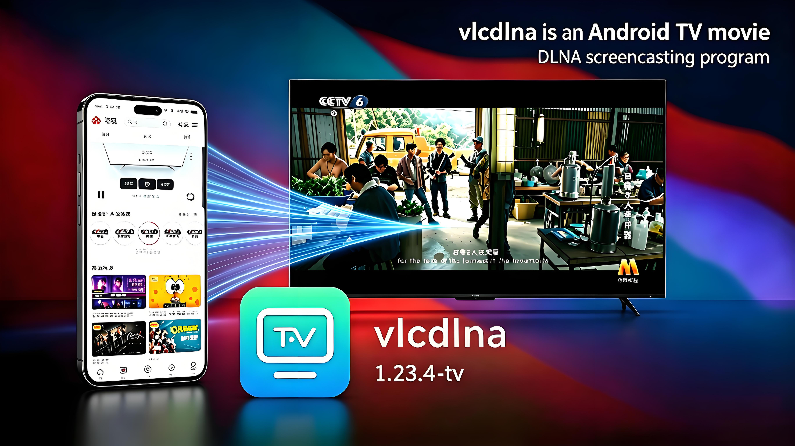

# 📺 VLCDLNA

**基于 libVLC 的 Android DLNA DMR 投屏接收端**

---

## 📖 项目介绍

**VLCDLNA** 是一款运行在 Android 设备上的 **DLNA DMR（Digital Media Renderer）** 应用，允许同一局域网内的设备通过 DLNA 协议将音视频无线投射到该设备播放。底层使用 **libVLC** 作为解码引擎，兼容最新 `tv.dlna` SDK。

## 🖥 APP介绍

软件介绍:→( **vlcdlna** 是一款安卓TV投屏软件,安上该软件可以让您的原生电视的投屏扩展增强,可让您的电视兼容其他格式的投屏视频,视频播放器采用vlc,让您的电视/盒子再战10年,该播放器目前只支持投视频,)

vlcdlna is an Android TV screencasting software. Installing this software can enhance the screencasting extension of your native TV, making your TV compatible with other formats of screencasting videos. The video player uses the vlc kernel, allowing your TV/box to compete for another 10 years. This player currently only supports video casting.
---

## ✨ 核心特性

| 特性 | 说明 |
|------|------|
| 🔍 自动发现 | 同一 WiFi 下可被系统投屏/视频 App 搜索到 |
| 📡 协议支持 | 完整实现 UPnP AVTransport / RenderingControl |
| 🎬 强大解码 | 基于 libVLC，支持 RTSP / HTTP / HLS / RTMP 等 |
| 📊 进度同步 | 每 800ms 向控制点上报播放进度与状态 |
| 🔒 UDN 持久化 | 设备唯一标识持久化，避免控制端频繁刷新 |

---

获取:→[[普通下载](https://gitee.com/zxc72/vlcdlna/releases/download/1.23/vlcdlna_1.23.4-tv.apk)]

## 🏗 软件架构

- x86_64 arm64
